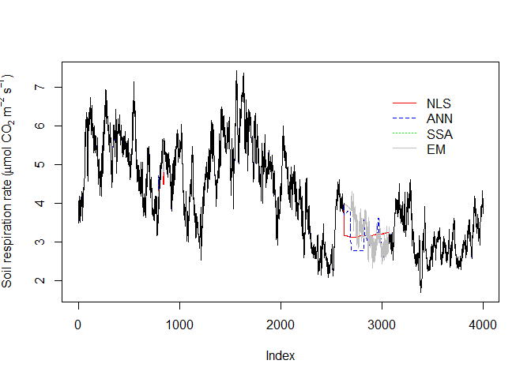

<!-- README.md is generated from README.Rmd. Please edit that file -->

# FluxGapsR

<!-- badges: start -->

<!-- badges: end -->

This is a package including four gap-filling methods for soil
respiration data investigated in the study of Zhao et al. (2020, see the
citation at the end). The four methods are referred to as non-linear
least squares (NLS), artificial neural networks (ANN), singular spectrum
analysis (SSA) and expectation-maximization (EM).

**Data preparation**

1.  The dataset with missing values to be gap-filled needs to be
    imported into R as a data frame with the missing values replaced by
    `NA`.
2.  In addition to the flux data to be gap-filled, a column with soil
    temperature data (in the same data frame) is needed for gap-filling
    with *NLS*.
3.  For *ANN*, up to three independent variables can be included
    (e.g. soil/air temperature, soil moisture) as inputs in the same
    data frame.
4.  *SSA* requires only the flux data to be filled.
5.  For *EM*, 1-3 reference flux datasets measured at the same time as
    the target flux series are required as inputs, which could be either
    in the same data frame or separate ones.
6.  Note that the date and time are required for *SSA* and *EM* as one
    column in each data frame in the format of either “ymd\_hms”,
    “mdy\_hms” or “dmy\_hms”.

**Package installation**

First, make sure the package `remotes` is installed in R. If not,
install the package by:

``` r
install.packages("remotes")
```

Then, install the `FluxGapsR` package in R by:

``` r
remotes::install_github("junbinzhao/FluxGapsR")
```

The functioning of the package is based on other R packages:
`dplyr`,`lubridate`,`spectral.methods`,`minpack.lm`,`mtsdi`,`neuralnet`
and they must be installed before using the functions in the `FluxGapsR`
package.

*Note: in case the installation fails in Rstudio, try to install the
package in the original R program and then load the package in Rstudio.*

**Examples**

``` r
library(FluxGapsR)

# load a fraction of example data for visualizing purpose
df <- read.csv(file = system.file("extdata", "Soil_resp_example.csv", package = "FluxGapsR"),
               header = T)[4000:8000,]
# load the example reference
df_ref <- read.csv(file = system.file("extdata", "Soil_resp_ref_example.csv", package = "FluxGapsR"),
                   header = T)[4000:8000,]

# use NLS
df_nls <- Gapfill_nls(data = df)
#> [1] "3 gaps are marked"
#> [1] "#1 out of 3 gaps: succeed!!"
#> [1] "#2 out of 3 gaps: succeed!!"
#> [1] "#3 out of 3 gaps: succeed!!"
#> 
#> ##### Summary #####
#> 
#> Total gaps:       3
#> < 1 day:          2
#> >= 1 & < 7 days:  1
#> >= 7 & < 15 days: 0
#> >= 15 days:       0
#> Failed gaps:      0

# use ANN
df_ann <- Gapfill_ann(data = df,var1 = "Ts",var2 = "Ta",var3 = "Moist")
#> [1] "3 gaps are marked"
#> [1] "#1 out of 3 gaps: succeed!!"
#> [1] "#2 out of 3 gaps: succeed!!"
#> [1] "#3 out of 3 gaps: succeed!!"
#> 
#> ##### Summary #####
#> 
#> Total gaps:       3
#> < 1 day:          2
#> >= 1 & < 7 days:  1
#> >= 7 & < 15 days: 0
#> >= 15 days:       0
#> Failed gaps:      0

# use SSA
df_ssa <- Gapfill_ssa(data = df)
#> [1] "3 gaps are marked"
#> Registered S3 method overwritten by 'xts':
#>   method     from
#>   as.zoo.xts zoo
#> Registered S3 method overwritten by 'quantmod':
#>   method            from
#>   as.zoo.data.frame zoo
#> Registered S3 methods overwritten by 'forecast':
#>   method             from    
#>   fitted.fracdiff    fracdiff
#>   residuals.fracdiff fracdiff
#> [1] "#1 out of 3 gaps: succeed!!"
#> [1] "#2 out of 3 gaps: succeed!!"
#> [1] "#3 out of 3 gaps: succeed!!"
#> 
#> ##### Summary #####
#> 
#> Total gaps:       3
#> < 1 day:          2
#> >= 1 & < 7 days:  1
#> >= 7 & < 15 days: 0
#> >= 15 days:       0
#> Failed gaps:      0

# use EM
df_em <- Gapfill_em(data = df,ref1 = df_ref)
#> [1] "3 gaps are marked"
#> [1] "#1 out of 3 gaps: succeed!!"
#> [1] "#2 out of 3 gaps: succeed!!"
#> [1] "#3 out of 3 gaps: succeed!!"
#> 
#> ##### Summary #####
#> 
#> Total gaps:       3
#> < 1 day:          2
#> >= 1 & < 7 days:  1
#> >= 7 & < 15 days: 0
#> >= 15 days:       0
#> Failed gaps:      0

# plot the results
plot(df_nls$filled,col="red",type = "l",
     ylab=expression("Soil respiration rate ("*mu*"mol CO"[2]*" m"^-2*" s"^-1*")"))
lines(df_ann$filled,col="blue",lty="dashed")
lines(df_ssa$filled,col="green",lty="dotted")
lines(df_em$filled,col="grey")
lines(df_nls$Flux)
legend(3000,7,
       legend=c("NLS","ANN","SSA","EM"),
       col=c("red","blue","green","grey"),
       lty=c("solid","dashed","dotted","solid"),
       box.lty=0)
```



**Please cite the package as:**

Junbin Zhao, Holger Lange and Helge Meissner. Gap-filling
continuously-measured soil respiration data: a highlight of the
time-series-based methods. Agricultural and Forest Meteorology, 2020,
doi: 10.1016/j.agrformet.2020.107912
